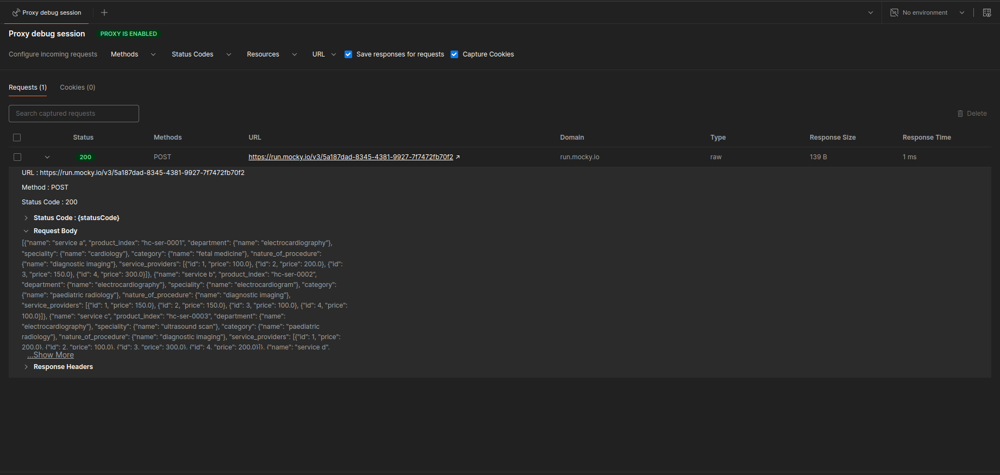

# HealthCenta

## Overview

This project processes healthcare service data, formats it into JSON, and posts it to a mock API. The pipeline includes data cleaning, transformation, and validation through unit tests. The code reads data, applies necessary transformations, and posts the processed data to a designated API endpoint. It also includes unit tests to ensure data processing integrity.

## Table of Contents

1. [Setup](#setup)

   - [Environment Setup](#environment-setup)

   - [Dependencies](#dependencies)

   - [Run Project](#run-project)

2. [Folder Structure](#folder-structure)

3. [Code Walkthrough](#code-walkthrough)

   - [Data Exploration](#data-exploration)

   - [Main Script](#main-script)

   - [Data Cleaning](#data-cleaning)

   - [Data Transformation](#data-transformation)

   - [API Client](#api-client)


4. [Testing](#testing)

5. [Future Improvements](#future-improvements)

---

## Setup

### Environment Setup
Ensure the following Python 3.x is installed before running the code:


#### 1. Clone repository and navigate into project
```bash
git clone git@github.com:Ruth-Mwangi/healthcenta.git
cd healthcenta
```
#### 2. Create virtual environment and activate it
```bash
python3 -m venv venv
source venv/bin/activate
```

#### 3. Environment Variables
1. Create a .env file to store environment variables:

```bash
touch .env
```
2. Add these variables to the `.env` file created.

```ini
# variables
BODY_PARTS= heart,head 
SERVICE_PROVIDERS= SP. 1,SP. 2,SP. 3,SP. 4

# mocky 
MOCKY_API=https://run.mocky.io/v3/5a187dad-8345-4381-9927-7f7472fb70f2

# postman proxies
POSTMAN_HTTP_PROXY=http://127.0.0.1:5559
POSTMAN_HTTPs_PROXY=http://127.0.0.1:5559

# data directory
RAW_DATA=data/raw/Sample data.xls
PROCESSED_DATA=data/processed/healthcenta_data.json
```

3. Feel free to customize the `.env` file based on your project needs.


### Dependencies

To install the dependencies, run the following command:

```bash
pip install -r requirements.txt
```

### Run Project
```bash
python src/main.py
```

## Folder Structure
The project is organized into several directories:

- src/: Contains the source code for the project, including modules for data processing, API interaction, and utilities.

- tests/: Includes unit tests for the various components.

- notebook/: Contains code to explore data

- data/: Contains raw and processed data

- requirements.txt: Lists the project’s dependencies.

- README.md: This file, which provides an overview of the project.

- .env: Environment variables (not tracked in version control).


## Code Walkthrough

### Data Exploration
This stage involves understanding the data, and helps in guiding how to handle missing values, outliers, standardizations of data  among other things.

The `eda.py` module in the notebook directory performs the following analysis:

   - Price Distribution: Examines how prices vary across departments and service providers.
   - Service Count by Category: Shows the number of services available in each category.
   - Average Prices: Calculates and visualizes average prices by service provider, department, and specialty.
   - Grouping Analysis: Analyzes average prices based on the nature of procedures, categories, and specialties to identify pricing trends.

The results highlight significant price variations and provide insights into service and pricing structures.


### Main Script

The main script (`main.py`) performs the following tasks:

- Loads environment variables from the `.env` file.
- Reads raw health data from an Excel file.
- Cleans the raw data using `clean_data()`.
- Transforms the cleaned data into JSON format using `transform_data_to_json()`.
- Saves the transformed data to a file.
- Posts the transformed data to the API using the `post_data_to_api()` function.

###  Data Cleaning

The `clean_data()` function in the `data_cleaning.py` module:

- Removes unnecessary columns.
- Handles missing values.
- Standardizes data formats.

### Data Transformation

The `transform_data_to_json()` function in the `data_transformation.py` module:

- Converts the cleaned data into a structured JSON format.

    ```json
   
   {
      'name': 'Service A',
      'product_index': 'HC-SER-0001',
      'department': {'name': 'ELECTROCARDIOGRAPHY'},
      'speciality': {'name': 'CARDIOLOGY'},
      'category': {'name': 'FETAL MEDICINE'},
      'nature_of_procedure': {'name': 'DIAGNOSTIC IMAGING'},
      'service_providers':
      [
      {
      'id': 1,
      'price': 100
      },
      {
      'id': 2,
      'price': 200
      },
      ...
      
      ]
   }

   ```

### API Client

The `post_data_to_api()` function in the `client.py` module:

- Reads the JSON data from a file.

- Posts the data to the API specified in the `.env` file.

#### Creating a Mock API with Mocky and Capturing Requests Using Postman

##### 1. **Creating a Mock API with Mocky**

Mocky allows you to create a mock API endpoint quickly. Follow these steps:

1. Visit [Mocky](https://mocky.io/).
2. Select **Create a new mock API**.
3. Copy the generated Mocky URL and update it in your `.env` file under `MOCKY_API`:

    ```ini
    MOCKY_API=https://run.mocky.io/v3/your-generated-mocky-url
    ```

##### 2. **Capturing API Requests with Postman (OPTIONAL)**

To test the API request and capture the response, use Postman:

1. Download and install Postman from [Postman website](https://www.postman.com/downloads/).
2. Open Postman
3. Follow the [Postman Capture traffic using the Postman built-in proxy tutorial](https://learning.postman.com/docs/sending-requests/capturing-request-data/capture-with-proxy/)
4. While creating the proxy use port 5559. if you choose a diffferent port update the port in the `.env` file

   ```ini
      # postman proxies
      POSTMAN_HTTP_PROXY=http://127.0.0.1:5559
      POSTMAN_HTTPs_PROXY=http://127.0.0.1:5559
   ```
5. Once everything is set up run the code
   ```bash
   python src/main.py
   ```
6. Observe the request sent by the code on postman

   
   

## Testing
The project includes unit tests for key data processing functions:

- Data Processing Tests (`test_data_processing.py`): Tests for the fuctions that perform cleaning and transforming data.

run the code below for unit tests

```bash
python -m unittest discover
```

